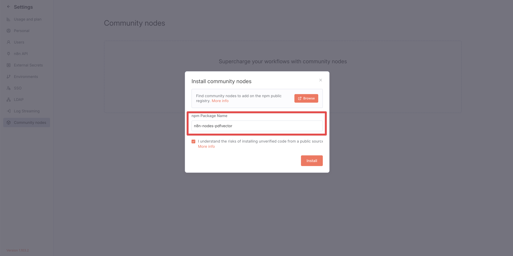
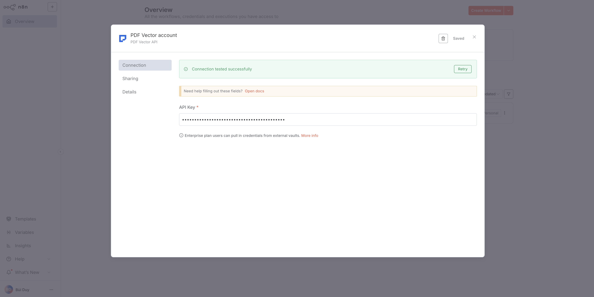

# n8n-nodes-pdfvector

This is an n8n community node. It lets you use PDF Vector in your n8n workflows.

PDF Vector is a powerful document processing and academic research API service. It enables you to parse PDFs and Word documents into clean Markdown, extract structured data, and search across millions of academic publications from multiple databases.

[n8n](https://n8n.io/) is a [fair-code licensed](https://docs.n8n.io/reference/license/) workflow automation platform.

## Table of Contents

- [Installation](#installation)
- [Operations](#operations)
- [Credentials](#credentials)
- [Compatibility](#compatibility)
- [Usage](#usage)
- [Resources](#resources)
- [Version history](#version-history)
- [Development](#development)
- [License](#license)

## Installation

Follow the [installation guide](https://docs.n8n.io/integrations/community-nodes/installation/) in the n8n community nodes documentation.

1. Go to `Settings` > `Community Nodes`.
2. Select `Install`.
3. Enter `n8n-nodes-pdfvector` in `Enter npm package name`.
4. Agree to the risks of using community nodes.
5. Select `Install`.



## Operations

### Document Resource

#### Parse Document

Extract content from PDF/Word documents and convert to clean Markdown format.

**Parameters:**

- **Document URL**: Direct URL to the PDF or Word document
- **Use LLM**:
  - `auto` (default) - System decides if LLM parsing is needed
  - `never` - Basic parsing only (1 credit per page)
  - `always` - Force LLM parsing (2 credits per page)

**Supported Formats:**

- PDF files
- Word documents (.doc, .docx)

**Credit Usage**: 1-2 credits per page depending on LLM usage

#### Ask Document

Ask questions about PDF/Word documents using AI analysis to get intelligent answers.

**Parameters:**

- **Document URL**: Direct URL to the PDF or Word document
- **Prompt**: Your question about the document (1-2000 characters)

**Example Questions:**
- "What are the key findings in this research paper?"
- "Summarize the methodology section"
- "What conclusions does the author draw?"
- "Extract all statistical results mentioned"

**Credit Usage**: 3 credits per page

### Academic Resource

#### Search Publications

Search for academic publications across multiple databases with intelligent ranking.

**Parameters:**

- **Query**: Search query string
- **Providers**: Select which academic databases to search (PubMed, Semantic Scholar, Google Scholar, ArXiv, ERIC)
- **Limit**: Maximum results per provider (1-100, default: 50)
- **Offset**: Skip this many results per provider
- **Year From/To**: Filter by publication year range
- **Fields**: Choose which fields to include in the response

**Credit Usage**: 2 credit per search request

#### Fetch Publications

Retrieve specific academic publications by their identifiers with automatic provider detection.

**Parameters:**

- **IDs**: Comma-separated list of publication IDs (DOI, PubMed ID, ArXiv ID, etc.)
- **Fields**: Choose which fields to include in the response

**Supported ID Types:**

- DOI (e.g., `10.1038/nature12373`)
- PubMed ID (e.g., `12345678`)
- ArXiv ID (e.g., `2301.12345`)
- Semantic Scholar ID (e.g., `85128297772`)
- ERIC ID (e.g., `ED123456`)

**Credit Usage**: 2 credit per fetch request

## Credentials

To use this node, you'll need a PDF Vector API key. Here's how to get one:

1. Sign up for a [PDF Vector account](https://www.pdfvector.com/sign-up)
2. Navigate to your [Dashboard](https://www.pdfvector.com/dashboard)
3. Generate a new API key (it will start with `pdfvector_`)
4. In n8n:
   - Go to **Credentials** → **Add Credential**
   - Select **PDF Vector API** from the list
   - Enter your API key
   - Click **Save**



## Compatibility

- **n8n version:** 0.202.0 or later
- **Node.js version:** 20.15 or later

## Usage

### Example: Ask Questions About a Document

This workflow shows how to use the Ask operation to get AI-powered answers about a document:

```json
{
  "nodes": [
    {
      "name": "Ask Document",
      "type": "n8n-nodes-pdfvector.pdfVector",
      "position": [250, 300],
      "parameters": {
        "resource": "document",
        "operation": "ask",
        "url": "https://example.com/research-paper.pdf",
        "prompt": "What are the main findings and conclusions of this research?"
      }
    }
  ]
}
```

The response will include:
- `markdown`: AI-generated answer to your question
- `pageCount`: Number of pages processed
- `creditCount`: Credits consumed

### Example: Parse a PDF and Search Related Papers

This workflow demonstrates how to:

1. Parse a PDF document to extract its content
2. Use the extracted content to search for related academic papers

```json
{
  "nodes": [
    {
      "name": "Parse PDF",
      "type": "n8n-nodes-pdfvector.pdfVector",
      "position": [250, 300],
      "parameters": {
        "resource": "document",
        "operation": "parse",
        "url": "https://example.com/paper.pdf",
        "useLLM": "auto"
      }
    },
    {
      "name": "Search Related Papers",
      "type": "n8n-nodes-pdfvector.pdfVector",
      "position": [450, 300],
      "parameters": {
        "resource": "academic",
        "operation": "search",
        "query": "={{ $json.markdown.substring(0, 200) }}",
        "providers": ["semantic-scholar", "pubmed"],
        "limit": 10,
        "offset": 0
      }
    }
  ]
}
```

### Example: Batch Fetch Publications

Fetch multiple publications by their DOIs:

```json
{
  "parameters": {
    "resource": "academic",
    "operation": "fetch",
    "ids": "10.1038/nature12373,10.1126/science.1234567,PMC123456"
  }
}
```

### Response Handling

All operations return structured JSON responses. Handle errors gracefully:

```javascript
// In a Function node after PDF Vector
if ($json.error) {
  throw new Error($json.error.message);
}

// For academic search - check for partial errors
if ($json.errors && $json.errors.length > 0) {
  console.warn("Some providers failed:", $json.errors);
}

return $json.results;
```

## Resources

- [n8n community nodes documentation](https://docs.n8n.io/integrations/community-nodes/)
- [PDF Vector API Documentation](https://www.pdfvector.com/v1/api/scalar)
- [PDF Vector Dashboard](https://www.pdfvector.com/dashboard)
- [PDF Vector Pricing](https://www.pdfvector.com/#pricing)


## Version history

- 0.1.0 - Initial release of the PDF Vector node for n8n.

## Development

Check out [documentation on creating nodes](https://docs.n8n.io/integrations/creating-nodes/) for detailed information on building and developing the node.

0. Install dependencies:

```bash
npm install
```

1. Build the node

```bash
npm run build
```

2. Link the node to n8n from the node directory

```bash
npm link
```

3. In your `~/.n8n/nodes` directory, link the node:

```bash
npm link n8n-nodes-pdfvector
```

4. Run n8n:

```bash
n8n start
```

Once the node is linked, you need to only rebuild and restart n8n to see the changes.

## License

This project is licensed [under the MIT License](LICENSE.md).
